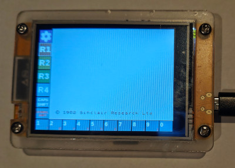
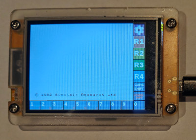
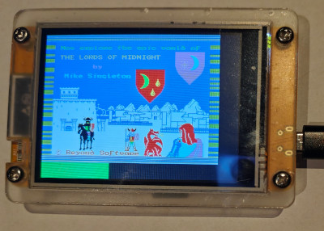
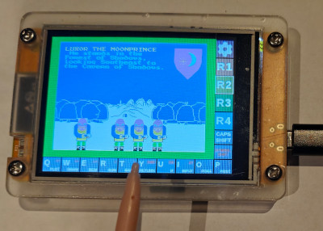
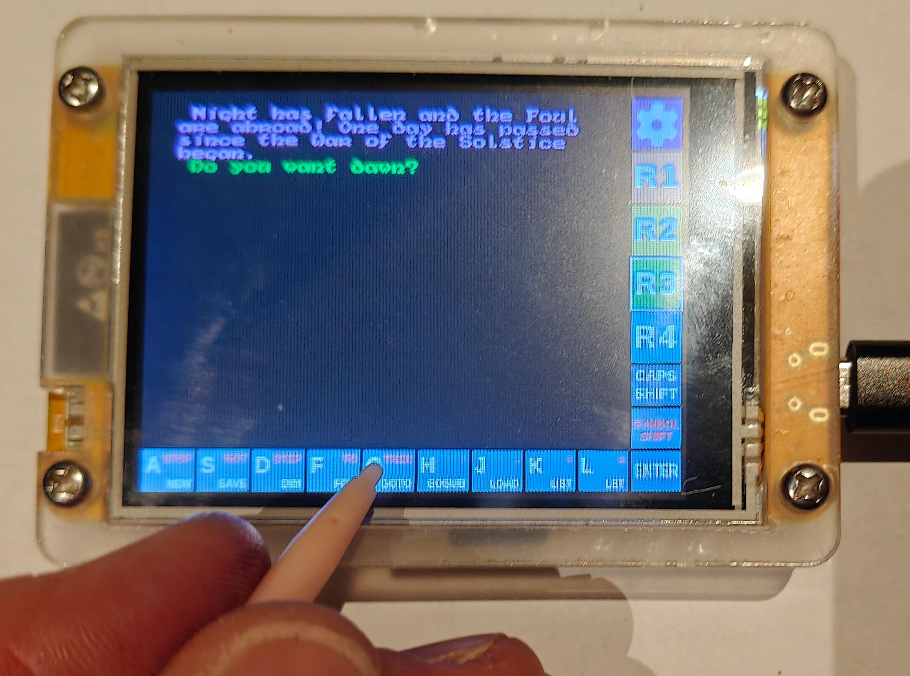
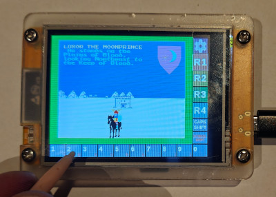

# ZX Spectrum for the Cheap Yellow Display

[](./LICENSE)

Firmware that turns a [Cheap Yellow Display (CYD)](https://www.google.com/search?q=esp32+cheap+yellow+display) ESP32-2432S028 into a 48K ZX Spectrum with an on-screen touch keyboard.

This project is a CYD-focused port of [atomic14's ESP32 ZX Spectrum emulator](https://github.com/atomic14/esp32-zxspectrum). The upstream tree also contains desktop and web builds; **this repository is maintained for the CYD board**.

## Features

- Boots straight into the **48K ZX Spectrum** (no model picker)
- **Resistive touch keyboard** with left- or right-handed layout
- Spectrum display with borders above the keyboard row
- **In-emulator menu** (Menu key or touch **Menu**): recalibrate, volume, snapshots, load games, poke, exit
- **SD card** support for `.z80`, `.sna`, `.tap`, and `.tzx` files
- Settings and touch calibration stored in LittleFS (`settings.json`), preserved across firmware uploads

## The Innovation

The innovation is the **touch-screen keyboard** that stays permanently available under the Spectrum display, with **R1–R4** buttons that switch between rows of the original Spectrum keyboard. It’s surprisingly usable, about as good as the original rubber keyboard, and it has the same spirit to it.

Left-handed and right-handed layouts:




Loading a game from tape file (`.tap` / `.tzx`):



Once loaded, you can navigate through the game as easily as with a real Spectrum:





Screenshots demonstrate the emulator using the best game ever written for the ZX Spectrum, namely *The Lords of Midnight* © 1984 Beyond Software / Mike Singleton.

I also plan a feature inspired by the old cardboard keyboard overlays: if there’s a matching <file>.KEY alongside a tape image (for example game.tzx + game.key), the on‑screen keyboard will temporarily relabel the keys with game-specific actions to act as a live overlay/cheat sheet.

## Hardware

Target board: **ESP32-2432S028** (320×240 ILI9341 TFT, XPT2046 touch, microSD on SPI).

| Function | GPIO |
|----------|------|
| TFT SPI | 14 SCLK, 12 MISO, 13 MOSI, 15 CS, 2 DC, 21 BL |
| Touch (bit-bang) | 33 CS, 36 IRQ, 25 CLK, 39 MISO, 32 MOSI |
| SD card | VSPI: CS 5, CLK 18, MISO 19, MOSI 23 (separate from TFT HSPI) |
| Buzzer (PWM) | 26 |

Other ESP32 boards from the upstream project may still build from `firmware/platformio.ini`, but **only `cheap-yellow-display` is the focus here**.

## Building and flashing (Ubuntu)

### Prerequisites

Install build tools and USB serial access:

```sh
sudo apt update
sudo apt install git python3 python3-venv python3-pip
```

Add your user to the `dialout` group so PlatformIO can access the CYD over USB (log out and back in, or reboot, after this):

```sh
sudo usermod -aG dialout $USER
```

### One-time setup

Clone this repository and create a local PlatformIO virtual environment in the repo root:

```sh
cd cyd-zxspectrum
python3 -m venv .pio-venv
.pio-venv/bin/pip install -U pip platformio
```

The first build downloads the ESP32 toolchain and libraries; it can take several minutes.

### Build, flash, and monitor

From the repository root:

```sh
# Build
.pio-venv/bin/pio run -e cheap-yellow-display --project-dir firmware

# Flash (CYD connected by USB; usually /dev/ttyUSB0 or /dev/ttyACM0)
.pio-venv/bin/pio run -e cheap-yellow-display --project-dir firmware -t upload

# Serial monitor (Ctrl+C to exit)
.pio-venv/bin/pio device monitor --project-dir firmware -b 115200
```

If upload fails to find the port, list devices and pass the port explicitly:

```sh
.pio-venv/bin/pio device list
.pio-venv/bin/pio run -e cheap-yellow-display --project-dir firmware -t upload --upload-port /dev/ttyUSB0
```

To erase flash and settings (forces touch calibration on next boot):

```sh
.pio-venv/bin/pio run -e cheap-yellow-display --project-dir firmware -t erase
.pio-venv/bin/pio run -e cheap-yellow-display --project-dir firmware -t upload
```

### Optional: VS Code

You can also open the `firmware` folder in [VS Code](https://code.visualstudio.com/) with the [PlatformIO IDE](https://platformio.org/install/ide?install=vscode) extension and use the **cheap-yellow-display** environment from the PlatformIO sidebar.

## First boot

On first boot the firmware:

1. Runs **four-corner touch calibration**
2. Asks for **left- or right-handed** keyboard layout

Calibration and settings are written to LittleFS and **are not erased** when you upload new firmware.

To calibrate again:

- Use **Erase Flash** in PlatformIO (`pio run -t erase`, then upload), or
- Open the in-emulator **Menu → Recalibrate**, or
- Set `"cydSetupComplete": false` in `settings.json` on the device

## Games and storage

**SD card (recommended):** format as **FAT32** (not exFAT; 64 GB cards work if formatted FAT32), copy `.z80`, `.sna`, `.tap`, or `.tzx` files to the card root (or use **Menu → Load game / tape** to browse).

**Without SD:** put files in `firmware/data/` and upload the filesystem (`pio run -t uploadfs`).

Snapshots are saved under `/snapshots` on the SD card when present.

## Optional: USB serial keyboard

The `keyboard-server/` directory has Python tooling to send keystrokes over USB serial (useful on a desk with the CYD connected). It has mainly been tested on macOS.

```sh
cd keyboard-server
python3 -m venv venv
source venv/bin/activate
pip install -r requirements.txt
python serial_keyboard.py
```

## Repository layout

| Path | Purpose |
|------|---------|
| `firmware/` | ESP32 firmware (PlatformIO) |
| `keyboard-server/` | Host-side serial keyboard helper |
| `desktop/` | Desktop builds (upstream) |
| `docs/` | Images and notes |

## License

GPL v3 — see [LICENSE](./LICENSE). Emulator core and much of the firmware derive from atomic14's [esp32-zxspectrum](https://github.com/atomic14/esp32-zxspectrum).
